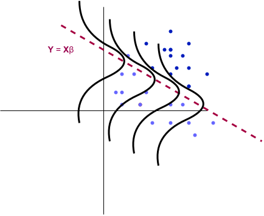

## Introduction

{#fig-linear-regression width=70%}

I am beginning this series as a way to discuss many popular machine learning models and important statistical analysis techniques associated.
Generalized Linear Models (GLMs) are a generalization of a linear model (hence the name). The standard linear model simply predicts our response as a linear combination of the predictors. For GLMs, the linear component remains but further complexity is added.
Using basic knowledge of the response variables we aim to predict, a suitable GLM can be chosen as the model. For example, when the output is naturally modeled as any real number, we will derive "linear regression".

Many popular statistical models belong to this group of GLMs and are thus more connected than it may seem at first glance. Let's see how these actually work.

## The Generalized Linear Model

A generalized linear model consists of three primary components:

1. A random component
2. A systematic component
3. A link function

### Random Component

Previously we mentioned how simple assumptions on the response variable defines the GLM. Let's make that more concrete. For GLMs, we assume our response variable $\mathbf{Y}$ comes from a particular distribution in an **exponential family**. 
An exponential family for a parameter $\theta$ takes the form:

$$
f_{X}(x \mid \theta) = h(x)\exp(\left[\eta(\theta)T(x) - A(\theta) \right]), \qquad h(x) \geq 0
$$

In other words, consider the density for some distribution, and see if it can be written in this form to determine whether or not it is in this exponential family.

We will skip most of the details, but it turns out many important distributions belong to this family: Bernoulli, Normal, Poisson, Gamma, Exponential, $\ldots$

### Systematic Component

As the name may suggest, each GLM contains a linear component of the form:

$$
\eta = \mathbf{X}\beta
$$

where $\mathbf{X}$ are the predictors and $\beta$ is the unknown model parameter we wish to learn. 

### Link Function

For a linear model, we assume

$$
\mathbb{E}(\mathbf{Y} \mid \mathbf{X}) = \mathbf{X}\beta
$$

however, for a GLM, we generalize this assumption by supposing

$$
\mathbb{E}(\mathbf{Y} \mid \mathbf{X}) = \mathbf{\mu} = g^{-1}(\mathbf{X}\beta)
$$

where $g$ is called the "link function", determining how our response related to the linear component.

This is what allows us to model responses which have constrained outputs. For another example, if we wish to model probabilities, our link function can be

$$
g(\mu) = \operatorname{ln}(\frac{\mu}{1 - \mu})
$$

Our response is then modeled with the mean function

$$
\mu = g^{-1}(\eta) = \frac{1}{1 - e^{-\eta}}
$$

forcing our predictions to be between $0$ and $1$.

## Examples

A few more examples are below along with the name of their associated link function and usual notation for the mean.

| Model | Distribution | Mean | Link |
|---|---|---|---|
| Linear Regression | Gaussian | $\mu$ | Identity |
| Logistic Regression | Bernoulli | $p$ | Logit |
| Poisson Regression | Poisson | $\lambda$ | Log |

So for linear regression, we will see in part $1$ of our series that the responses for each data are modeled as Gaussian and the associated link function is just the identity, so that

$$
g(\mathbf{X}\beta) = \mathbf{X}\beta
$$

## Estimation

After deciding how to model our data with a GLM, we need to find "optimal" parameters for our data. To do this, we introduce the likelihood function for our unknown parameter $\beta$: $L(\beta)$.

Given some parameter $\beta$, we ask "How likely was I to observe this data?". Assuming independent data, we compute the likelihood as a product of probabilities for each data:

For observed data: $\left(x_i, y_i \right)_{i=1}^{n}$,

$$
L(\beta) = \Pi_{i=1}^{n}p(x_i \mid \beta)
$$

the parameters are then estimated through maximum likelihood:

$$
\hat{\beta}_{MLE} = \operatorname{argmax}_{\beta} L(\beta).
$$

The form of this optimization problem will depend on the response distribution and link function and is usually solved numerically.

## Statistical Inference

Once beta has been estimated, we may ask:

- How uncertain are the coefficient estimates?
- Which predictors have evidence of association with the response?
- How should coefficients be interpreted?
- How well does the model fit?
- How uncertain are predictions?

While we won't answer every statistical question for each GLM project, we will introduce them slowly throughout the series as we discuss various models.

## Series

As the series is being created, I will include the links to each part below. 

### Part 1: Linear and Logistic Regression

In part 1, we will look at linear and logistic regression in the framework of GLMs and MLE. We will perform some basic experiments and then ask important statistical questions regarding our results.

[Read Part 1](linear-logistic-regression/)

### Future Parts

Additional models and topics will be added as the series develops.