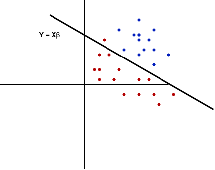

# Summary

- 

## Introduction

{#fig-linear-model width=70%}

In part one of our GLM series we will be looking at two of the simplest machine learning models: linear regression and logistic regression. We will make sure to distinguish the two, as their purposes are quite distinct. While both are named "regression" (continuous output), logistic regression
is used for classification tasks while linear regression is used to extrapolate continuous values. However, they both result in simple, linear models.

The above figure demonstrates a linear model which could be viewed as performing either classification or regression depending on the data.

## Linear Regression

In our GLM overview, we discussed how GLMs are determined by choosing a conditional response distribution from the exponential family, along with a link function. For our linear regression model, we would like our output space to be the whole real line. This corresponds to a natural choice of modeling our conditional response distribution as Normal/Gaussian.

