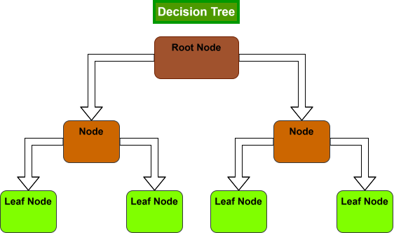

# Summary
- Language: Python

- Core dependency: NumPy

- Datasets: Toy data, Make Moons, MNIST

- Repository: [link](https://github.com/josephcasey922/decision-tree-from-scratch)

# Decision Tree from scratch

## Introduction
Decision trees are one of the simplest machine learning methods for regression and classification. In this project, we will be focused on classification, however, the extension to regression problems is natural.
The idea is simple: continually ask the "strongest" questions possible in order to reasonably infer the class of a given data point. These are "yes" or "no" questions that allow us to (hopefully) place our classes into distinct categories that can generalize to unseen data.

The structure of a decision tree is composed of nodes, including one root node, intermediate nodes, and many leaf nodes. Each node refers to a single yes or no question that functions to partition our dataset (training) or deduce the class of a given data point (testing).
If the question (condition) of a node is met, then we move down and left, otherwise we move down and to the right. Leaf nodes are responsibly for predicting the class. The majority class for the training data that ended up at a leaf node determine the prediction.

Not all questions are treated equally, but firstly, how do we come up with questions? In this code, we will implement the simplest method: construct possible threshold splits as the midpoint between each unique data point for each feature.
The choice on whether or not to split the data based on this threshold is what we refer to as the yes or no question. For now we consider one popular criterion for whether or not a split is considered strong or not: Gini impurity.
While these have nice information theoretic stories, the main idea is that we wish to make large splits that create disproportionality in the classes. 

The first is called "Gini impurity". This gives us a measure of how impure a single node is. It is

$$
\operatorname{Gini} = 1 - \sum_{i=1}^{C}p(i)^2
$$

where $p(i)$ is the propertion of samples in class $i$. Gini impurity is $0$ if the node contains only one class. That would be considered pure. It is highest when the proportions for each class are $\frac{1}{2}$.
This makes sense since we wish for nodes to be able to identify samples with a given class, and in the end they will predict base on their majority class.

This implemnented in the code with a function that takes in a vector of targets:

```python
def gini(y):
    proportions = np.unique(y, return_counts=True)[1] / len(y)
    return 1 - np.sum(proportions**2)
```
To determine how strong a given split is, we take a weighted combination of Gini impurities for the left and right nodes:

$$
\operatorname{Gini}("split") = \frac{n_1}{n}\operatorname{Gini}("left") + \frac{n_2}{n}\operatorname{Gini}("right")
$$

where $n_1 + n_2 = n$. 

{#fig-decision-tree width=70%}

## Motivation
The motivation for this project is two-fold: to understand decision trees and the necessity of recursive logic, and practice performing basic statistical analysis, looking at things like:

- overfitting
- cross-validation
- bootstrapping
- confusion matrices
- pruning

## Implementation
The most important part of decision trees is deciding how to structure the classes. Initially, we may try to make a class for: tree, root node, intermediate nodes, leaf nodes. We will need the tree class to handle the high level structure, but it turns output
that we only need a single node class. The root node and intermediate nodes have the same functionality, and we will be able to condition appropriately on the node to decide whether it acts as a leaf node or not. Let's check how the node class works.

```python
class Node:
    def __init__(self, feature = None, threshold = None, left_node = None, right_node = None, value = None):
        self.feature = feature
        self.threshold = threshold
        self.left_node = left_node
        self.right_node = right_node
        self.value = value
        return
```

We see that the node does not contain any of the functionality, it simply holds pertinent information to guide movement down the tree.

1. The first component is ```feature```, this refers to the feature from the data that we will condition on (or ask questions about).
2. The second component is ```threshold```, this decides what numeric value to split on for the decided feature. 
3. The third and fourth class variables contain the child nodes. Each node, besides the leaf nodes, will contain two child nodes based on the above condition. Therefore, instances of leaf nodes will keep this variables as "None".
4. Lastly, we have ```value```. This is only for use by leaf nodes to decide which class to predict. Other nodes will keep this as "None". This design choice allows use to easily identify between leaf nodes and other nodes.

There is also an important point on recursion to note here. The node instance will generally contain other node instances. This will allow the root node to contain the entire tree.
The last part of the code is the tree class. Let's go through each of the functional components.

```python
class DecisionTree:
    def __init__(self, impurity="gini", max_depth=None, min_split = 2):
        self.max_depth = max_depth
        self.min_split = min_split
        self.impurity = impurity
        return
```

We initialize by choosing the impurity ("entropy" is another criterion choice in the code), the maximum depth of the tree, and the minimum number of data points we need to consider another split.
The max depth is necessary since otherwise, we could just end up with one leaf per data point. This would lead to serious ***overfitting***.

The most important part of the code is the function ```_best_split``` which determines the splitting thresholds with lowest Gini impurity:

```python
    def _best_split(self, x, y):

        best_feature = None
        best_threshold = None
        best_impurity = np.inf
        # check each partition class proportions and loss
        for j in range(x.shape[1]):

            # construct unique thresholds for column j
            vals = np.unique(x[:,j])
            thresholds = (vals[:-1] + vals[1:]) / 2

            for threshold in thresholds:

                left_ind = x[:,j] <= threshold
                right_ind = x[:,j] > threshold

                y_left = y[left_ind]
                y_right = y[right_ind]

                n_left = len(y_left)
                n_right = len(y_right)
                n = n_left + n_right

                # ignore invalid splits
                if len(y_left) == 0 or len(y_right) == 0:
                    continue

                left_impurity = gini(y_left)
                right_impurity = gini(y_right)

                gini_imp = (n_left / n) * left_impurity + (n_right / n) * right_impurity

                if gini_imp < best_impurity:
                    best_impurity = gini_imp
                    best_feature = j
                    best_threshold = threshold
        return best_feature, best_threshold, best_impurity
```
First consider

```python
for j in range(x.shape[1]):
    vals = np.unique(x[:,j])
    thresholds = (vals[:-1] + vals[1:]) / 2
```

This goes through the columns of a dataset and returns the midpoints for each unique value in column $j$. This defines the values we check for splitting on each feature.

Next, we consider each threshold and split the dataset accordingly:

```python
for threshold in thresholds:

    left_ind = x[:,j] <= threshold
    right_ind = x[:,j] > threshold

    y_left = y[left_ind]
    y_right = y[right_ind]

    n_left = len(y_left)
    n_right = len(y_right)
    n = n_left + n_right
```

Note that we only need the labels for each split to calculate impurity and thus we only save the necessary indices.

To complete the iterations, we save the information corresponding to the best splits:

```python
 left_impurity = gini(y_left)
right_impurity = gini(y_right)

gini_imp = (n_left / n) * left_impurity + (n_right / n) * right_impurity

if gini_imp < best_impurity:
    best_impurity = gini_imp
    best_feature = j
    best_threshold = threshold
```

We compute the weighted impurity of nodes as we discussed in the introduction and save the feature and threshold value that were used. We also save the impurity value here, although it is not necessary for making the tree.

With the node class, and ability to find the best split, we conclude with construction of the tree:

```python
    def _build_tree(self, x, y, depth):

        # check if node is pure
        if len(np.unique(y)) == 1:
            return Node(value = y[0])

        # check if max depth reached or node has fewer than minimum data requirement
        if depth == self.max_depth or x.shape[0] < self.min_split:
            classes, counts = np.unique(y, return_counts=True)
            return Node(value = classes[np.argmax(counts)])

        best_feature, best_threshold, best_impurity = self._best_split(x, y)

        # check if no valid threshold (all features are the same)
        if best_feature is None:
            classes, counts = np.unique(y, return_counts=True)
            return Node(value = classes[np.argmax(counts)])

        left_indices = x[:, best_feature] <= best_threshold
        right_indices = x[:, best_feature] > best_threshold
        return Node(feature=best_feature, threshold = best_threshold,
                    left_node = self._build_tree(x[left_indices,:],
                                                y[left_indices],
                                                depth + 1),
                    right_node = self._build_tree(x[right_indices,:],
                                                 y[right_indices],
                                                 depth + 1))
```

The first three conditional statements are when we may want to stop. Namely, the third one says stop if we cannot even find a best split (rows are the same). The first says: If the node is pure (contains only one class) then return the class it contains as the prediction. The second two are for when we meet the stopping criteria (discussed above).

The main implementation is this last return block. This shows how the tree is built recursively, _build_tree returns the nodes once we need to stop, and we call this function within the Node initialization. 

The final function to train the tree is ```fit```:

```python
def fit(self, x, y):
    self.root = self._build_tree(x, y, 0)
    return self.root
```

We start with the root (depth $0$) and a dataset of our choice, and the recursive code handles the rest.

## Experiments
For now, we only include a small toy example to show that this works. Let

$$
x = np.array([[1.0, 2.0],[2.0,1.0],[3.0,3.0],[6.0,2.0],[7.0,1.0],[8.0,3.0]])
y = np.array([0,0,0,1,1,1])
$$

so that we have $6$ data points and two classes. In order to evaluate the tree we construct, we will use the two functions in the tree class:

```python
def _predict_row(self, x, node):
    # only leaf nodes have a value != None
    if node.value is not None:
        return node.value

    if x[node.feature] <= node.threshold:
        return self._predict_row(x, node.left_node)
    else:
        return self._predict_row(x, node.right_node)

# returns leaf prediction
def predict(self, x):
    # go sample by sample
    predictions = []

    for i in range(x.shape[0]):
        predictions.append(self._predict_row(x[i,:], self.root))
    return np.array(predictions)
```

This initially takes in a data point and root node and continually progresses down the tree by checking ```node.value``` which is only "not None" for leaf nodes to return the majority class.

For the toy example, the full training is just these few lines:

```python
tree = DecisionTree(impurity = "gini", max_depth=3, min_split=2)

tree.fit(x,y)

predictions = tree.predict(x)
print("Training Accuracy:", np.mean(predictions == y))
```

And for predicting on some test data:

```python
x_new = np.array([
    [1.5, 2.5],
    [7.5, 2.5],
    [4.0, 1.0]
])

new_predictions = tree.predict(x_new)

print("\nNew predictions:")
print(new_predictions)
```

If done correctly, training and testing accuracy on this toy data should be perfect.

## Analysis

There are a handful of important concepts from machine learning which apply to analyzing decision trees. We will look into these by first applying our decision tree to the Iris classification dataset.

