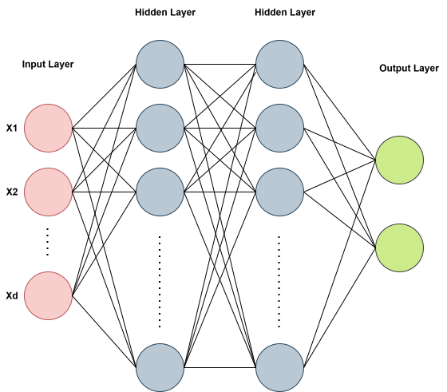
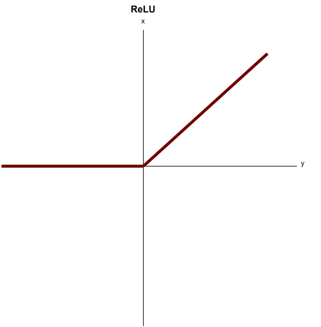

# Summary
- Language: Python

- Core dependency: NumPy

- Models: MLP

- Datasets: Toy data, Make Moons, MNIST

- Implemented: Linear layers, activations, CE loss, SGD

- Repository: [link](https://github.com/josephcasey922/MLP_from_scratch)


# Multilayer Perceptron From Scratch

## Introduction

A multilayer perceptron (MLP) is one of the most basic neural networks architectures. The architecture consists of an input layer, hidden layer(s) and an output layer. The input layer contains a number of neurons equal to the dimension of the dataset, and the output layer will depend on the problem. For a $C$-classification problem, the output layer will contain $C$ neurons.

Each layer in the MLP consists of **neurons**, with adjacent layer's neurons being fully connected. This can be seen in the following image with two **hidden layers**:

{#fig-mlp-architecture width=70%}

## Motivation

Our goal for the project is to intricately understand the workings of a basic neural network before moving on to more complicated ones. We will manually code the linear layers, activation functions, and loss functions, including the respective derivatives. Only after this, we can see how to code a similar network in minutes using PyTorch.

## Architecture

### General Network Structure

The architecture of our MLP will change depending on the experiment we are running. More complicated classification problems will require a more sophisticated network. 
The basic pattern of layers in the MLP goes like this:

**Input features** $\rightarrow$ **Linear Layer** $\rightarrow$ **Activation** $\ldots$ **Output Layer** $\rightarrow$ **Output Activation**

where $ldots$ can be replaced by more Linear + Activation layers (more hidden layers), and the number of neurons in each linear layer will vary depending on the desired complexity.

For this project, we will be utilizing cross-entropy loss and performing classification tasks on various datasets.

### Layer Design

For coding neural networks in python, it is very useful to utilize classes. Each layer utilizes a linear function, activation function, or loss function. We will define each of these things using a python class that includes functions to handle the forward pass and backward pass through the network. For example, for a linear class instance, we can call linear.forward to move the data through the network and linear.backward to move the gradients backward from the linear layer.

### Network Container

The code to handle all of the forward and backward passes is contained in a network class. 

```python
class Network:
    def __init__(self, layers):
        self.layers = layers

    def forward(self, x):
        output = x
        for layer in self.layers:
            output = layer.forward(output)

        return output

    def backward(self, grad_output):
        grad = grad_output
        for layer in reversed(self.layers):
            grad = layer.backward(grad)
        return grad
```

Once we give the network our desired layer choices, it will handle the forward and backward processes by using the corresponding forward and backward functions defined in each layer class

### Example Network

We will run multiple experiments with our network at the end, but for now, we can see some example layers that we may choose:
Our simplest network will have the following layers:

```python
network = Network([
    Linear(2, 4),
    ReLU(),
    Linear(4, 2),
    Softmax()
])
```

The network class takes in an ordered list of network layers, which is enough to compute the entire forward and backward processes by simply go through the list in order and then in reverse.
In this example, we begin with an input layer accepting $2$ dimensional data with an output in $4$ dimensions. The output must match the input dimension of the next linear layer (hidden layer).

After the linear layer, we use ReLU activation, preserving the dimensions and preparing for the next linear layer. The final linear layer is called the output layer. Since the output dimension is $2$,
we can see that this prepares us for an activation that will perform binary classification by using the final softmax classification. Each of these layers/classes will be explained below.

## Forward Propagation

Let's follow this simple network above mathematically and show how the code handles it equivalently. We will start with the data matrix, and move all the way forward through our network.

Suppose we have a "batch" of inputs $X \in \mathbb{R}^{B \times 2}$ (this matches the need for $2$ dimensional data input). That is, we have $B$ data samples, each with $2$ "features".

### Linear Layer

The first linear layer should be able to take in this batch of samples and map them to a linear function of the form:

$$
Z_1 = XW_1 + b_1
$$

where $W_1 \in \mathbb{R}^{2 \times 4}$, and $b_1 \in \mathbb{R}^4$. 

Let's see if this makes sense. Our first linear layer should take our $2$ dimensional input and map to a $4$ dimensional output (as indicated by ```Linear(2, 4)```). We can see that $XW_1 \in \mathbb{R}^{B \times 4}$. Then $b_1 \in \mathbb{R}^{4}$ is added, defining the bias for each neuron thus giving us that
$Z_1 \in \mathbb{R}^{B \times 4}$. 

Each column of $W_1$ is acting as linear weights for each of the $4$ corresponding neurons in the first linear layer. 

Let's check the code for this linear forward computation:

```python
class Linear:
    def __init__(self, input_dim, output_dim):
        rng = np.random.default_rng()
        self.input_dim = input_dim
        self.output_dim = output_dim

        # He initialization with ReLU
        self.W = rng.normal(loc = 0.0, scale = np.sqrt(2.0 / self.input_dim),
                            size = (self.input_dim, self.output_dim))


        self.b = np.zeros(self.output_dim)


    def forward(self, x):
        #self.batch_size = x.shape[0]
        self.x = x
        z = self.x @ self.W + self.b
        return z
```

We see that the linear class is initialized with intput and output dimensions ($2$ and $4$ in our case). The weight matrix $W$ is initialized (ignore the way we initialized for now) with ``` size``` using those dimensions while the bias $b$ is initialized to $0$ using the output dimension.

The forward function is then very simple, we simply compute $Z = XW + b$ and return it. For efficient coding, we will need to save computations that are relevant to the derivative calculations we will do during backpropagation. I have excluded these for now, and we will discuss them later. 

Recall again our simple network we defined above:

```python
network = Network([
    Linear(2, 4),
    ReLU(),
    Linear(4, 2),
    Softmax()
])
```

We have finished the linear forward pass, now we pass our matrix $Z_1$, containing the linear components from each of $4$ neurons, into **ReLU** activation. 

### Activation Layer

ReLU is a nonlinear function, performed element-wise on $Z_1$ and takes the form

$$
f(x) = \operatorname{max}(0,x)
$$

{#fig-ReLU width=70%}

This is one choice of activation included in the code and is defined with the class:

```python
class ReLU:
    def __init__(self):
        self.mask = None

    def forward(self, x):
        return np.maximum(0, x)
```

We denote the ReLU output as:

$$
A_1 = \operatorname{ReLU}(Z_1)
$$

where $A_1 \in \mathbb{R}^{B \times 4}$ is the same dimensions as $Z_1$.

NumPy is able to compute this very cleanly with the maximum function. We can ignore the class variable of ```mask``` for now as that wil be used later.
Again, I have excluded anything to do with the backpropagation for now.

### Hidden Layer

Now we move on to the final linear layer which is called a "hidden layer". This is because it has no direct access to the data matrix $X$ that be inputted into the network at the start.
This runs off the same linear class we introduced earlier, but now accepts an input dimension of $4$ and outputs a dimension of $2$. Since this is the final linear layer, setting us up for the final classification, it is also referred to as the "output layer".

The first linear layer acted on $X$, this second linear layer is now acting on the previous ReLU output $A_1$. Mathematically, the linear class has not changed; We simply replace $X$ with $A_1$ and compute:

$$
Z_2 = A_1 W_2 + b_2
$$

where $W_2 \in \mathbb{R}^{4 \times 2}$ (as indicated by ``` Linear(4, 2) ```) and $b_2 \in \mathbb{R}^{2}$. 

Similar to before, we can see $Z_2 \in \mathbb{R}^{B \times 2}$. It is necessary here that the output dimension is $2$ in order for us to perform binary classification with the following final layer.

### Softmax Layer

The final layer in our network is the **softmax** layer. This is also considered an activation layer but has the explicit purpose of preparing the previous linear output for classification. 
For a given vector $z = (z_0, z_1, \ldots z_C)$, it is defined by the function:

$$
\operatorname{softmax}(z) = \frac{e^{z_i}}{\sum_{j=0}^{C}e^{z_j}}
$$

From each row of $Z_2$, it takes each of the two elements and turns them into probabilities that add up to $1$. We denote the matrix of softmax probabilites as 

$$
$P(Z_2) \in \mathbb{R}^{B \times 2}$
$$

When the first row component has a higher probability, our network believes the data vector should be classified as $0$, and when the second probability value is higher, our network believes the sample to be from class $1$. 
This is implemented in the code with the Softmax class:

```python
class Softmax:
    def __init__(self):
        self.output = None

    def forward(self, x):
        shifted_x = x - np.max(x, axis=1, keepdims=True)
        self.output = np.exp(shifted_x) / np.sum(np.exp(shifted_x), axis=1, keepdims=True)
        return self.output
```

For numerical stability, we shift the data using the maximum value in order to prevent errors from large exponential values. You can check that shifting $z_i$'s in the softmax definition will not change the output.

Since we need to sum each of the exponential of each row components, NumPy has the sum over axis $1$. It is important to have ```keepdims=True``` so that once we use NumPy to sum the exponentials, it won't collapse the dimensions along this axis.

### Cross-Entropy Loss
In order to guide learning, we must provide ground truths ($0$ or $1$) for each of our $B$ data samples in $X \in \mathbb{R}^{B \times 2}$. So Let

$$
y \in \mathbb{R}^{B \times 2}
$$

be the one-hot matrix of labels for our data. For our example, each row of $y$ is a vector of two numbers, $0$ and $1$, with the position of $1$ indicating the true class label. For $C$ classes, each row would contain a $1$ at the true class position and the rest would be $0$.
We know that softmax will output probabilites for each sample to be of a certain class. In general, we can let $p_i$ denote the probability for the $i$th component of the probability vector. We can penalize poor predictions from our network by using **cross-entropy loss** defined as:

$$
CE = -\sum_{i}y_i \log{(p_i)}
$$

This is the loss on a single prediction vector. Based on how we defined $y$, we have $y_i = 0$ for any position $i$ that is not corresponding to the true class label. However, this definition arises from information theory and is more generally defined between two probability distributions, so we keep this form.

In our example, each vector is of dimension $2$ so that softmax turns each row into $[p_1, p_2]$ where $p_1 + p_2 = 1$. 
Let's check the code:

```python
class CrossEntropyLoss:
    def __init__(self):
        self.correct_probs = None

    def forward(self, pred, label):
        self.num_classes = pred.shape[1]
        self.label = label
        self.batch_size = pred.shape[0]
        clipped_pred = np.clip(pred, 1e-12, 1)
        self.row_indices = np.arange(self.batch_size)
        self.correct_probs = clipped_pred[self.row_indices, self.label]
        loss = -np.sum(np.log(self.correct_probs))/self.batch_size
        return loss
```

The key to understanding this code is noticing the two lines: 

```self.row_indices = np.arange(self.batch_size)``` 

```self.correct_probs = clipped_pred[self.row_indices, self.label] ```

The first line defines a vector of integers from $0$ up to $B$ to index through our data matrix. The second line indexes the position of the true label within our softmax matrix of predictions. This is all we need since cross-entropy loss only penalizes our probability for the true class position.

## Backpropagation

Now that we have moved through each layer, the last step is to update our weight matrices $W_1, W_2$ and biases $b_1, b_2$ in order to minimize the cross-entropy loss on our predictions.
To do this, we wish to use gradient descent by first computing the derivative of the loss with respect to each of our learned parameters:

$$
\frac{\partial CE}{\partial W_1}, \frac{\partial CE}{\partial W_2}, \frac{\partial CE}{\partial b_1}, \frac{\partial CE}{\partial b_2}
$$


## Experiments

## GitHub